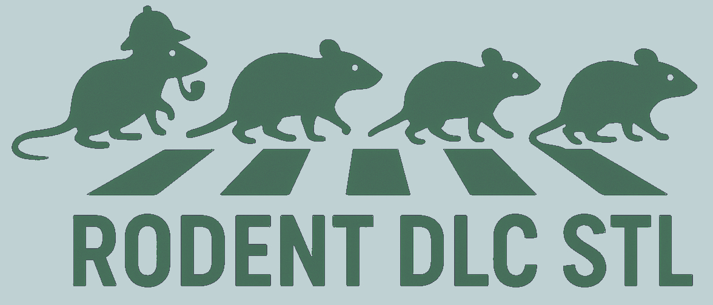
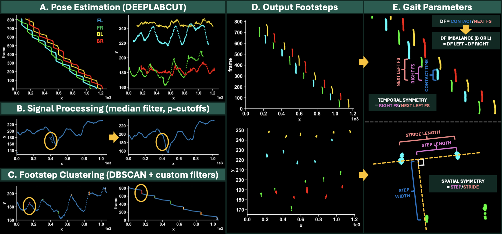

# DLC_FILTER_PIPELINE
<a id="readme-top"></a>
<!-- PROJECT SHIELDS -->
<!--
*** I'm using markdown "reference style" links for readability.
*** Reference links are enclosed in brackets [ ] instead of parentheses ( ).
*** See the bottom of this document for the declaration of the reference variables
*** for contributors-url, forks-url, etc. This is an optional, concise syntax you may use.
*** https://www.markdownguide.org/basic-syntax/#reference-style-links
-->
[![Contributors][contributors-shield]][contributors-url]
[![Forks][forks-shield]][forks-url]
[![Stargazers][stars-shield]][stars-url]
[![Issues][issues-shield]][issues-url]
[![Unlicense License][license-shield]][license-url]
[![LinkedIn][linkedin-shield]][linkedin-url]


<!-- PROJECT LOGO -->
<br />
<div align="center">
  <a href="https://github.com/shawnpavey/DLC_FILTER_PIPELINE">
    
  </a>

  <h3 align="center">Rodent DeepLabCut Pipeline, Musculoskeletal Soft Tissue Laboratory</h3>

  <p align="center">
    An automated pipeline for extracting gait parameters from rodent videos!
    <br />
    <a href="#getting-started">Jump to Getting Started</a>
    &middot;
    <a href="https://github.com/shawnpavey/DLC_FILTER_PIPELINE/issues/new?labels=enhancement&template=feature-request---.md">Report Bug or Request Feature</a>
  </p>
</div>


***
<!-- TABLE OF CONTENTS -->
<details open>
  <summary>Table of Contents</summary>
  <ol>
    <li>
      <a href="#about-the-project">About The Project</a>
      <ul>
        <li><a href="#built-with-deeplabcut">Built With DeepLabCut</a></li>
        <li><a href="#wustl-musculoskeletal-soft-tissue-lab">WUSTL Musculoskeletal Soft Tissue Lab</a></li>
        <li><a href="#gait-analysis-background">Gait Analysis Background</a></li>
        <li><a href="#project-structure">Project Structure</a></li>
      </ul>
    </li>
    <li>
      <a href="#getting-started">Getting Started</a>
      <ul>
        <li><a href="#prerequisites">Prerequisites</a></li>
        <li><a href="#installation">Installation</a></li>
        <li><a href="#tutorial">Tutorial</a></li>
      </ul>
    </li>
    <li>
      <a href="#adding-animals-and-backgrounds">Adding Animals and Backgrounds</a>
      <ul>
        <li><a href="#training-a-dlc-model">Training a DLC Model</a></li>
        <li><a href="#installing-a-new-dlc-model">Installing a new DLC Model</a></li>
        <li><a href="#how-to-expand-the-project">How to Expand the Project</a></li>
      </ul>
    </li>
    <li><a href="#contributing">Contributing</a></li>
    <li><a href="#license">License</a></li>
    <li><a href="#contact">Contact</a></li>
    <li><a href="#acknowledgments">Acknowledgments</a></li>
  </ol>
</details>


***
<!-- ABOUT THE PROJECT -->
## About The Project

Rodent gait analysis can be a painful bottleneck for labs in terms of data acquisition and analysis. This project was
born out of necessity to further automate gait analysis and enhance the flexibility of the input data. With the 
Rodent_DLC_STL pipeline, the user simply needs to use a single Jupyter notebook with 2 code blocks.

The first code block prompts the user to click an avi file for automated pose estimation and step isolation. That's it!
The second code block asks the user to select an outer folder, then the folder for a given batch, and finally a single
calibration file, and automatically extracts gait parameters such as duty factors, symmetry, step width etc...

<p align="center">
    
</p>

<p align="right">(<a href="#readme-top">back to top</a>)</p>

***
### Built With DeepLabCut

Under the hood, this project is powered by a custom DeepLabCut-trained model for pose estimation:

* DeepLabCut: [https://github.com/DeepLabCut/DeepLabCut]

This is theoretically more flexible than using color-thresholding and adjacent methods, but is practically only as 
viable as the training data allows. The default model was trained on C57BL6 mice in the mouse GAITOR set up at 500 fps,
in an arena similar to what has been described in Kyle Allen's work:

* GAITOR Arena: https://www.gaitor.org/spatiotemporal-only-arena.html
* Publication mentioning mouse arena adaptations: https://www.nature.com/articles/s41598-018-28134-1

A road map for integrating your own models is provided below:

* README: <a href="#adding-animals-and-backgrounds">Adding Animals and Backgrounds</a>

<p align="right">(<a href="#readme-top">back to top</a>)</p>

***
### WUSTL Musculoskeletal Soft Tissue Lab

This work was done in the Musculoskeletal Soft Tissue Laboratory at Washington University in Saint Louis. While you are
encouraged to reach out to the developer of this package with questions, feel free to contact relevant current members 
as described on the lab website if you have additional questions or if I do not respond within a reasonable amount of
time:

* Prof. Spencer Lake's mSTL @ WUSTL: https://lakelab.wustl.edu

<p align="right">(<a href="#readme-top">back to top</a>)</p>

***
### Gait Analysis Background

Other gait analysis pipelines often rely on multiple views of the rodent to determine foot strike timing, but this
pipeline works with only a bottom view of the animal. Clustering (DBSCAN) is applied along with some custom filtering
to determine paw contact, which is a decent method in mice (~5% error), but may not be immediately appropriate in 
animals that hover the foot in the final position before contact (such as rats). More information is provided below 
with regard to adding new animals to the pipeline and adding information from a side view for more accurate contact
detection in rats (<a href="#adding-animals-and-backgrounds">Adding Animals and Backgrounds</a>).

Explanations of the extracted gait parameters are partially described in the intro figure, but more detailed explanation
is provided in Prof. Kyle Allen's published work:

* Introductory figure (README): <a href="#about-the-project">About The Project</a>
* Gait Parameters (Prof. Kyle Allen): https://pmc.ncbi.nlm.nih.gov/articles/PMC4180257/

<p align="right">(<a href="#readme-top">back to top</a>)</p>

***
### Project Structure

#### CORE FUNCTIONALITY
The engine of this project is stored in the `dlcfilterpipeline` folder. Within that folder, package behavior is
orchestrated by a manager object as defined in `manager.py`. Default inputs to this object creation are visible in the
`__init__.py` file, which users can browse in case they need to tweak defaults (for example DBSCAN parameters).
<br>

#### DEEPLABCUT PROCESSES
A DeepLabCut model is stored in `dlc-models-pytorch` and in the `config.yaml` file, and the functions "analyze" and
"create labeled videos" are called in processes within your conda's DEEPLABCUT environment, which is a prerequisite for
running this code (<a href="#prerequisites">Prerequisites</a></li>).
<br>

#### SIMPLE JUPYTER NOTEBOOK USER INTERFACE
A simple Jupyter notebook interface `DLC_PIPELINE.ipynb` is provided for easily running this pipeline:

The first cell does the following in a single run:
1. Loads data into the manager object
2. Performs Pose Estimation
3. Filters the data
4. Extracts footsteps

The second cell in the Jupyter notebook:
1. Manually excludes faulty trials with a practical GUI (keyboard shortcuts enabled, Y for keep, N for exclude)
2. Extracts scale information from the calibration video (pixels/m)
3. Calculates gait parameters and adjusts spatial values for scale, creating a master sheet for the batch

#### DOCKER FUNCTIONALITY (Advanced Users)
Some extra files included in this package include Docker files and helpers. An outdated but functional release of this 
project exists as a Docker image, though it can take quite a bit of work to funnel the correct inputs/volumes into the
container, and the `failure_logger.py`, `extract_calibration_scale.py`, and `calculator_top_velocity.py` are not
included. This Docker image is extremely useful for cluster computing however, permitting batch pose-estimation which
the user can follow up with post-processing functions such as the three previously mentioned ones with ease.

* Docker Image: https://hub.docker.com/r/shawnpavey/dlc_filter_pipeline/tags

<p align="right">(<a href="#readme-top">back to top</a>)</p>

***
<!-- GETTING STARTED -->
## Getting Started

If your setup is similar to the default setup in this project (similar arena and 500 FPS camera and 20wk old C57BL6 
mice, either uninjured or with partial Achilles tendon transection), you can get started:

> OVERVIEW/QUICKSTART:
> 1. Install a conda distribution (Anaconda is the most general) to prepare for managing environments
> 2. Create a DEEPLABCUT conda environment (<a href="#prerequisites">Prerequisites</a>)
> 3. Create a DLCPIPE conda environment to run the notebook (<a href="#installation">Installation</a>)
> 4. Update 'dlc_venv_path' in `DLC_PIPELINE.ipynb` (path for DEEPLABCUT env python, <a href="#prerequisites">Prerequisites</a>)
> 5. Structure your data as described below as avi video files (<a href="#tutorial">Tutorial</a>)
> 6. Run the first cell in `DLC_PIPELINE.ipynb` for pose estimation (ensure DLCPIPE env is used)
> 7. Run the second cell in `DLC_PIPELINE.ipynb` for gait parameter calculations 
> 8. Analyze the master data with your preferred stats methods (we used JMP linear-mixed models)

If you need to tweak the pipeline at all, here are some options:

> OPTIONS/EXPANDING
> * Look at `__init__.py` to determine if there are readily available variables you could tweak in the notebook
> * Train your own DeepLabCut model if you have a different type of animal or arena (<a href="#training-a-dlc-model">Training a DLC Model</a>)
> * Create an enhanced pipeline incorporating the side view (<a href="#how-to-expand-the-project">How to Expand the Project</a>)
>* Contact us for situations not listed above (<a href="#contact">Contact</a>)

<p align="right">(<a href="#readme-top">back to top</a>)</p>

***
### Prerequisites

1. Conda distribution (likely Anaconda for most users): https://www.anaconda.com/download
2. DeepLabCut conda environment: https://github.com/DeepLabCut/DeepLabCut/blob/main/docs/installation.md
3. Jupyter (included in Anaconda, but can also set up in other IDEs for convenience)
  
<p align="right">(<a href="#readme-top">back to top</a>)</p>

***
### Installation

1. Download this project (download the folder/fork the repository)
2. Create a DEEPLABCUT conda environment
> * Download DeepLabCut's config.yaml: https://github.com/DeepLabCut/DeepLabCut/blob/main/conda-environments/DEEPLABCUT.yaml#
> * Navigate to the folder containing DEEPLABCUT.yaml in the terminal:
> ```sh
> cd your/folder/path/here
> ```
> * Create DEEPLABCUT environment
> ```sh
> conda env create -f DEEPLABCUT.yaml
> ```
> * Instructions recap: https://github.com/DeepLabCut/DeepLabCut/blob/main/docs/installation.md
3. Create a DLCPIPE conda environment
> * Navigate to the folder containing DLCPIPE.yaml (this package location) in the terminal:
> ```sh
> cd your/folder/path/here
> ```
> * Create DLCPIPE environment
> ```sh
> conda env create -f DLCPIPE.yaml
> ```
4. Start Jupyter in DLCPIPE env or select Python interpreter manually in `DLC_PIPELINE.ipynb` 
5. Change inputs:{'dlc_venv_path'} in the first cell to the DEEPLABCUT python path
6. Optional: fine tune other inputs (variables listed in `__init__.py`)

<p align="right">(<a href="#readme-top">back to top</a>)</p>

***
### Tutorial

A simple Jupyter notebook interface is provided for easily running this pipeline. 


> **NOTE (Folder Structure):** Proper functioning of this package relies on a pretty strict folder structure. While some 
> flexibility is built in, any deviation from this structure has the potential to mess up its dreamy automation.
>
> * Structure: GAIT/20250827/AVI/20250303_4421_01.avi
> * Automatically Generated Output Structure: GAIT/20250827analyzed/SUBPLOTS
> * Most raw data and pose estimation is kept in the initial folder, all plots and DATA.mat files in the second


#### CELL 1: Pose Estimation, Footstep Detection
The first cell performs pose estimation and footstep detection. 

Press play, and simply multi-select avi files to run this automatically (roughly 2.5 minutes per video). 
The outputs of this cell include a variety of plots of pre- and post-filtered limb tracking (general pose estimation 
and footstep detection), labeled videos, and most importantly the DATA.mat files which consist of one row per footstep 
used for gait parameter calculation.

#### CELL 2: Exclusion, Scaling, Gait Parameters
The second cell provides trial exclusion, pixel scaling, and gait parameter calculation. 

Press play, and you will be prompted to select an outer default folder (eg. GAIT, see structure below), then select a 
batch (eg. GAIT/20250827analyzed below), then press cancel. You will be taken to a GUI where you can keep or reject 
trials (keyboard shortcuts Y and N), these are written to a file that is read in the next step. 

After the trial exclusion GUI, select a bottom calibration file (scale bar within the bottom view), and click two 
points 15 inches apart. 

After this, gait parameters will automatically be calculated for the whole folder from the failure_logger as individual 
Excel files and in a MASTER file.

> **NOTE (Independent py files):** Some of the clunky GUI/folder selection is due to the fact that cell 2 actually strings
> together independent py files that can easily be used in parallel rather than the series approach of this pipeline.
> If you have a backlog perhaps it is easier to exclude within each batch then scale within each etc... But for the most
> part the automation in this pipeline should instead encourage quick and easy processing within days of acquiring data.

<p align="right">(<a href="#readme-top">back to top</a>)</p>

***
<!-- ADDING ANIMALS AND BACKGROUNDS -->
## Adding Animals and Backgrounds

WRITE HERE

<p align="right">(<a href="#readme-top">back to top</a>)</p>

***
### Training a DLC Model

WRITE HERE

<p align="right">(<a href="#readme-top">back to top</a>)</p>

***
### Installing a New DLC Model

WRITE HERE

<p align="right">(<a href="#readme-top">back to top</a>)</p>

***
### How to Expand the Project

WRITE HERE

<p align="right">(<a href="#readme-top">back to top</a>)</p>

***
<!-- CONTRIBUTING -->
## Contributing

Contributions are what make the open source community such an amazing place to learn, inspire, and create. Any contributions you make are **greatly appreciated**.

If you have a suggestion that would make this better, please fork the repo and create a pull request. You can also simply open an issue with the tag "enhancement".
Don't forget to give the project a star! Thanks again!

1. Fork the Project
2. Create your Feature Branch (`git checkout -b feature/AmazingFeature`)
3. Commit your Changes (`git commit -m 'Add some AmazingFeature'`)
4. Push to the Branch (`git push origin feature/AmazingFeature`)
5. Open a Pull Request

***
### Top contributors:

<a href="https://github.com/shawnpavey/DLC_FILTER_PIPELINE/graphs/contributors">
  
</a>

<p align="right">(<a href="#readme-top">back to top</a>)</p>


***
<!-- LICENSE -->
## License

Distributed under the MIT License. See `LICENSE.txt` for more information.

<p align="right">(<a href="#readme-top">back to top</a>)</p>


***
<!-- CONTACT -->
## Contact

Shawn Pavey - shawn.pavey@wustl.edu

Project Link: [https://github.com/shawnpavey/DLC_FILTER_PIPELINE](https://github.com/shawnpavey/DLC_FILTER_PIPELINE)

<p align="right">(<a href="#readme-top">back to top</a>)</p>


***
<!-- ACKNOWLEDGMENTS -->
## Acknowledgments

* [DeepLabCut](https://github.com/DeepLabCut/DeepLabCut/tree/main)
* [GAITOR](https://www.gaitor.org)
* [Readyplot](https://github.com/shawnpavey/readyplot)
* [Choose an Open Source License](https://choosealicense.com)

<p align="right">(<a href="#readme-top">back to top</a>)</p>

<!-- MARKDOWN LINKS & IMAGES -->
<!-- https://www.markdownguide.org/basic-syntax/#reference-style-links -->
[contributors-shield]: https://img.shields.io/github/contributors/shawnpavey/DLC_FILTER_PIPELINE.svg?style=for-the-badge
[contributors-url]: https://github.com/shawnpavey/DLC_FILTER_PIPELINE/graphs/contributors
[forks-shield]: https://img.shields.io/github/forks/shawnpavey/DLC_FILTER_PIPELINE.svg?style=for-the-badge
[forks-url]: https://github.com/shawnpavey/DLC_FILTER_PIPELINE/graphs/contributors/network/members
[stars-shield]: https://img.shields.io/github/stars/shawnpavey/DLC_FILTER_PIPELINE.svg?style=for-the-badge
[stars-url]: https://github.com/shawnpavey/DLC_FILTER_PIPELINE/graphs/contributors/stargazers
[issues-shield]: https://img.shields.io/github/issues/shawnpavey/DLC_FILTER_PIPELINE.svg?style=for-the-badge
[issues-url]: https://github.com/shawnpavey/DLC_FILTER_PIPELINE/graphs/contributors/issues
[license-shield]: https://img.shields.io/github/license/shawnpavey/DLC_FILTER_PIPELINE.svg?style=for-the-badge
[license-url]: https://github.com/shawnpavey/DLC_FILTER_PIPELINE/graphs/contributors/blob/master/LICENSE.txt
[linkedin-shield]: https://img.shields.io/badge/-LinkedIn-black.svg?style=for-the-badge&logo=linkedin&colorB=555
[linkedin-url]: https://www.linkedin.com/in/shawn-pavey-5243ab157/
[Next.js]: https://img.shields.io/badge/next.js-000000?style=for-the-badge&logo=nextdotjs&logoColor=white
[Next-url]: https://nextjs.org/
[React.js]: https://img.shields.io/badge/React-20232A?style=for-the-badge&logo=react&logoColor=61DAFB
[React-url]: https://reactjs.org/
[Vue.js]: https://img.shields.io/badge/Vue.js-35495E?style=for-the-badge&logo=vuedotjs&logoColor=4FC08D
[Vue-url]: https://vuejs.org/
[Angular.io]: https://img.shields.io/badge/Angular-DD0031?style=for-the-badge&logo=angular&logoColor=white
[Angular-url]: https://angular.io/
[Svelte.dev]: https://img.shields.io/badge/Svelte-4A4A55?style=for-the-badge&logo=svelte&logoColor=FF3E00
[Svelte-url]: https://svelte.dev/
[Laravel.com]: https://img.shields.io/badge/Laravel-FF2D20?style=for-the-badge&logo=laravel&logoColor=white
[Laravel-url]: https://laravel.com
[Bootstrap.com]: https://img.shields.io/badge/Bootstrap-563D7C?style=for-the-badge&logo=bootstrap&logoColor=white
[Bootstrap-url]: https://getbootstrap.com
[JQuery.com]: https://img.shields.io/badge/jQuery-0769AD?style=for-the-badge&logo=jquery&logoColor=white
[JQuery-url]: https://jquery.com 